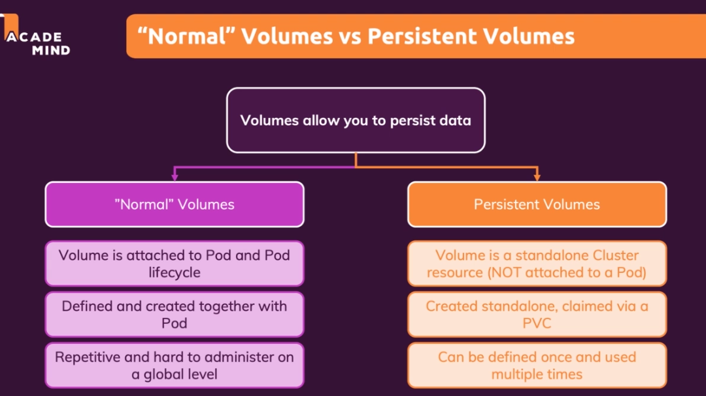

## Purpose
To learn how volumes are integrated with Kubernetes environment.

## Kube VS Docker Volumes

## To Run The Service
`minikube service story-service`

## Understanding The State

## Normal Volume VS Persistent Volume

If a "normal" volume is deleted, then the data is deleted. Persistent volume does not.
Ideal for those who wants to create your own app or for smaller app. 

Persistent volume is suitable for bigger projects.
